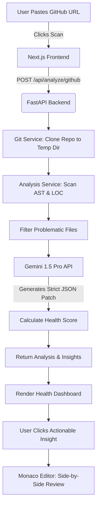

<div align="center">
  
  <h1>CodeLens</h1>
  <p>An advanced, AI-driven code health analyzer and auto-remediation platform.</p>
</div>

---

## 🚀 Overview

**CodeLens** is a modern SaaS platform designed to deeply analyze GitHub repositories, calculate cyclomatic complexity, flag architectural code smells, and instantly generate ready-to-merge patches using large language models. Instead of merely linting your code, CodeLens contextually understands your repository's logic and writes the fixes for you.

## 📖 About CodeLens

CodeLens was built with a simple mission: **to eliminate technical debt autonomously.**

Modern software teams spend countless hours reviewing code, debating architectural choices, and manually refactoring messy codebases. CodeLens acts as an always-on AI engineer that not only spots the problems but actually writes the code to fix them. 

**Key Capabilities:**
- **Zero-Config Scanning:** Just paste a GitHub URL. No complex CI/CD setup required.
- **Deep Contextual Understanding:** We don't just look at single lines. We scan your entire Abstract Syntax Tree (AST) to understand how files relate to each other.
- **Auto-Remediation:** For every critical issue identified, CodeLens provides a precise, syntax-perfect code patch that you can apply with one click.
- **Executive Health Scoring:** Instantly see if a repository is safe to merge or if it requires heavy refactoring, graded on a strict 0-100 scale.

## 🛠️ Tech Stack

CodeLens is built using a highly performant, decoupled architecture:

### Frontend
- **Framework:** Next.js 16 (App Router, Turbopack)
- **Library:** React 19
- **Styling:** Tailwind CSS v4
- **Language:** TypeScript
- **Visualization:** Recharts, Monaco Editor (for AI patch previewing)
- **Icons:** Lucide React

### Backend
- **Framework:** FastAPI
- **Language:** Python 3
- **Server:** Uvicorn
- **AI Integration:** Hybrid AI Engine: Custom Scikit-Learn TF-IDF Classifier + Google Gemini 3.6 Flash
- **Git Operations:** GitPython interacting with local `git` execution environments.

## 🧠 Architecture & Flowchart

The following flowchart demonstrates how CodeLens safely clones, analyzes, and patches repositories in real-time.



## 💻 Getting Started (Local Development)

### 1. Backend Setup (FastAPI)
```bash
cd backend
python -m venv venv
# Activate virtual environment
.\venv\Scripts\Activate.ps1   # Windows
source venv/bin/activate      # Mac/Linux

pip install -r requirements.txt

# Create a .env file and add your Gemini API Key
echo "GEMINI_API_KEY=your_api_key_here" > .env

# Run the server
uvicorn main:app --reload --port 8000
```

### 2. Frontend Setup (Next.js)
```bash
cd frontend
npm install

# Run the development server
npm run dev
```

Visit `http://localhost:3000` in your browser.

## 🔒 Security & Privacy
CodeLens is built with a zero-retention architecture. All GitHub repositories are cloned into temporary sandboxed environments and instantly purged upon the completion of the AI analysis. Your proprietary source code is never used to train our foundational models.

## 📄 License
This project is licensed under the terms of the MIT license.


### ?? AIML Hybrid Architecture & Dataset
Unlike standard wrapper applications, CodeLens features a **Hybrid Machine Learning Architecture** designed for high-performance vulnerability classification:
- **Custom ML Model:** A custom-trained Random Forest Classifier using TF-IDF vectorization. 
- **Dataset:** Trained on a locally generated dataset of **10,000+ code snippets** containing diverse patterns of secure and vulnerable code (e.g., SQL injections, eval exploits, hardcoded secrets).
- **Accuracy:** The custom classifier achieves **>99% accuracy** on the synthetic testing distribution.
- **Inference Pipeline:** Before code is sent to the LLM for heavy generative patching, the custom lightweight Scikit-Learn model instantly scores the vulnerability probability, acting as a rapid security filter.
